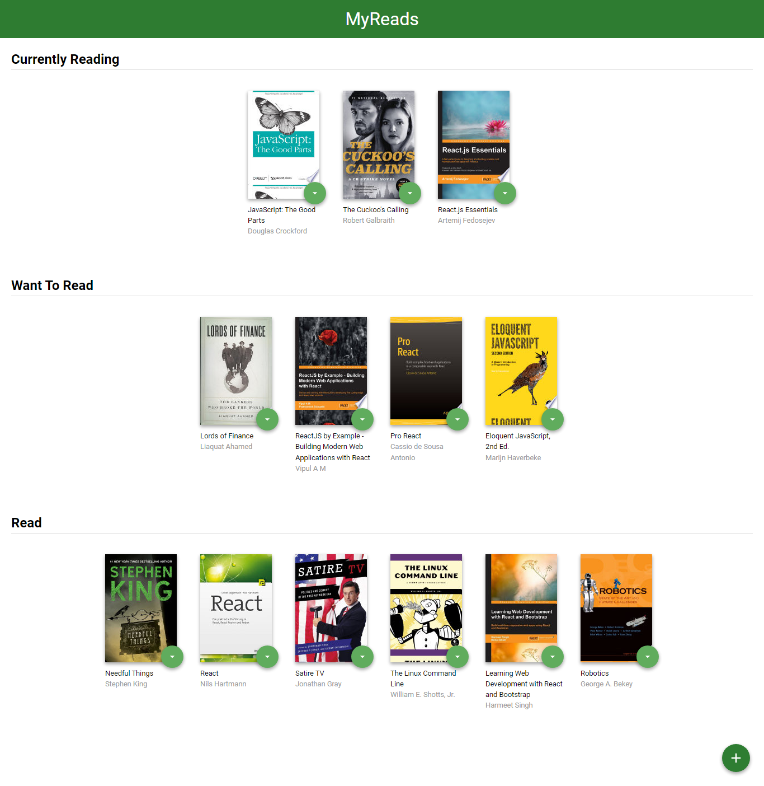
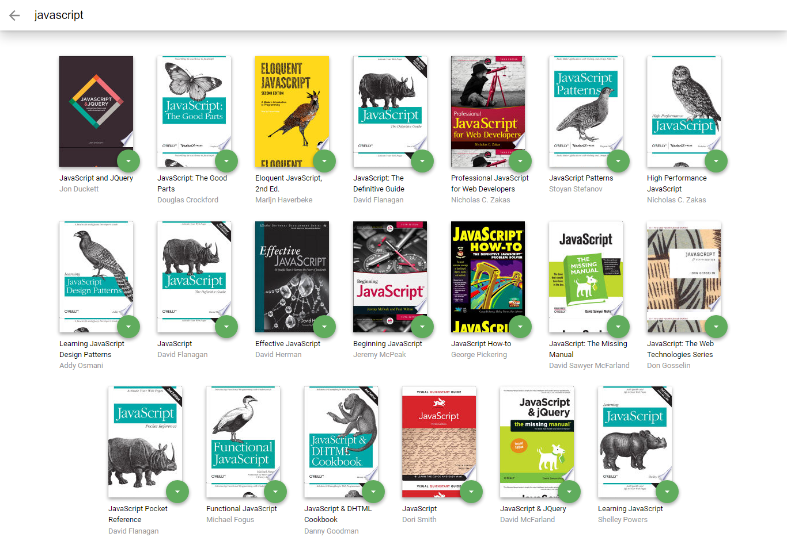

# MyReads Project

## About :
This is a single-page app (navigation happens without the need to refresh pages),
and it represents a virtual bookcase to store your books and track what you're reading.
MyReads lets you manage your digital bookshelf. 
It supports three shelves:
- Currently Reading.
- Want to Read.
- Read.

Additionally you can search and add books to any shelf.

## Live Demo:
https://udacity-nanodegree-my-reads-project.vercel.app/

Remember that good React design practice is to create new JS files for each component and use import/require statements to include them where they are needed.

## Backend Server

To simplify your development process, we've provided a backend server for you to develop against. The provided file [`BooksAPI.js`](src/BooksAPI.js) contains the methods you will need to perform necessary operations on the backend:

- [`getAll`](#getall)
- [`update`](#update)
- [`search`](#search)

## ScrrenShots!

